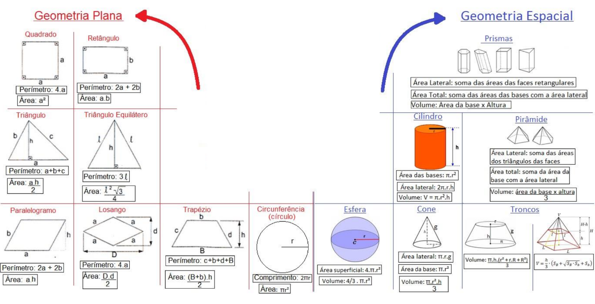

# Java-Geometria-Espacial-e-Plana
classes para geometria espacial e plana

Desenvolver um sistema em Java, com aplicação de Orientação a Objetos (OO), para realizar cálculos de Geometria Plana e Geometria Espacial. O programa deve permitir que o usuário escolha o tipo de cálculo, insira os valores e visualize o resultado diretamente no console.

# OBJETIVOS
* Aplicar orientação a objetos em Java com herança, polimorfismo e encapsulamento.
* Implementar métodos que calculam área e perímetro a partir de fórmulas geométricas.
* Estruturar um pequeno projeto com validações, testes e um menu de uso.

# REQUISITOS
1. Duplas de desenvolvimento
A atividade deve ser feita em dupla.
O projeto deve estar hospedado no GitHub da dupla.

2. Estrutura de classes
* Criar duas classes:
  * GeometriaPlana → Contendo métodos para cálculos de figuras planas.
 * GeometriaEspacial → Contendo métodos para cálculos de sólidos geométricos.
* Cada método deve implementar cálculos conforme as fórmulas fornecidas nas imagens de referência.

3. Classe principal de execução
* Deve conter um menu interativo que permita:
 * Escolher o tipo de cálculo (plano ou espacial).
 * Selecionar a figura desejada.
 * Inserir valores necessários (raio, base, altura, etc.).
* Exibir o resultado formatado na tela.
* O programa só deve encerrar quando o usuário escolher explicitamente a opção Sair.

4. Fórmulas e cálculos
* Os cálculos devem seguir as fórmulas indicadas nas imagens de referência.
* Exemplo de métodos esperados:
 * Geometria Plana: área e perímetro de círculo, retângulo, triângulo, polígono regular.
 * Geometria Espacial: volume e área superficial de cubo, esfera, cilindro, prisma, etc.

5. Testes obrigatórios
* Todos os métodos de cálculo devem ser testados para garantir resultados corretos.

# CRITÉRIOS
* Correção e precisão dos cálculos.
* Uso adequado de conceitos de Orientação a Objetos (atributos, métodos, encapsulamento).
* Estrutura e clareza do código.
* Funcionalidade do menu interativo.
* Organização e versionamento no GitHub.

Cobertura dos testes.
